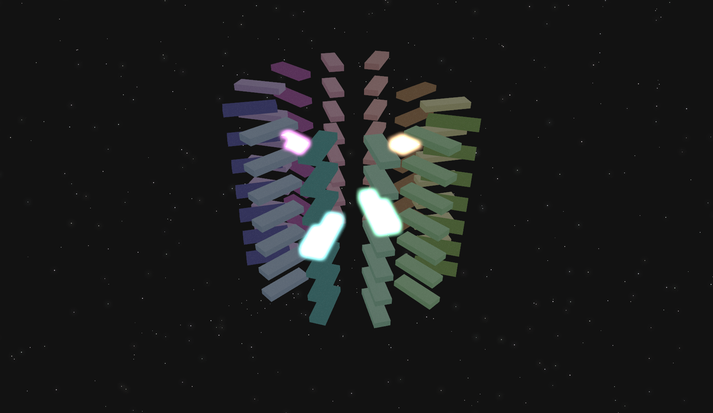

# Piano Spiral



A 3D interactive piano spiral with dynamic post-processing effects built using React, Three.js, and Vite.

## Features

- 3D piano spiral with dynamic positioning of keys.
- Post-processing effects: Bloom, Vignette, and Noise.
- Interactive piano keys that change color when clicked.
- Smooth lighting effects.

## Running
```bash
npm install
npm run dev
```

And then visit http://localhost:5173 in your browser.